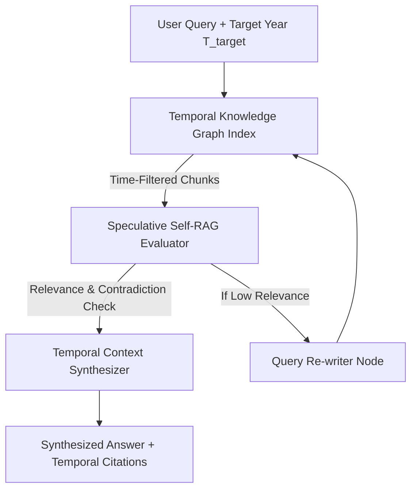

# Self-Corrective Temporal GraphRAG Engine 🧠 ⏳

[](https://opensource.org/licenses/MIT)
[](https://www.typescriptlang.org/)
[](https://en.wikipedia.org/wiki/Retrieval-augmented_generation)

**Author:** anderdebona

---

## 📌 Abstract & Research Goals

Naive Retrieval-Augmented Generation (RAG) suffers from **Temporal Context Contamination** (mixing outdated and current facts) and **Blind Top-K Trust**.

The **`self-corrective-temporal-graph-rag`** introduces a novel RAG architecture featuring:
1. **Temporal Knowledge Graph Indexing ($T_{start} \le T_{target} \le T_{end}$)**.
2. **Speculative Self-RAG Corrective Evaluator** (detecting temporal contradictions & hallucination risks).
3. **RAPTOR-style Hierarchical Concept Tree Chunks**.
4. **Automated Query Re-Writing & Audit-Trail Citations**.

---

## 🔬 Mathematical Formulation

Given Query $Q$, target timestamp $T_{target}$, and Temporal Knowledge Graph $G_{temp} = (V, E, I_{val})$:

$$V_{retrieved} = \{ v \in V \mid T_{target} \in I_{val}(v) \land \text{Sim}(Q, v.concept) > \theta \}$$

$$\text{RelevanceScore}(Q, V_{retrieved}) = \frac{1}{|V_{retrieved}|} \sum_{v \in V_{retrieved}} \mathbb{I}(T_{target} \in I_{val}(v))$$

---

## 🏛️ System Architecture



---

## 🚀 Quickstart & Installation

```bash
# Clone repository
git clone https://github.com/anderdebona/self-corrective-temporal-graph-rag.git
cd self-corrective-temporal-graph-rag

# Install dependencies
npm install

# Build & Run Server & Web Dashboard
npm run dev
```

Visit the interactive visual dashboard at: **`http://localhost:3007`**

---

## 🧪 Automated Unit Testing

```bash
npm test
```

---

## 📜 Citation & License

```bibtex
@software{anderdebona2026temporalrag,
  author = {anderdebona},
  title = {Self-Corrective Temporal GraphRAG Engine},
  year = {2026},
  publisher = {GitHub},
  journal = {GitHub Repository},
  howpublished = {\url{https://github.com/anderdebona/self-corrective-temporal-graph-rag}}
}
```

Licensed under the MIT License.
