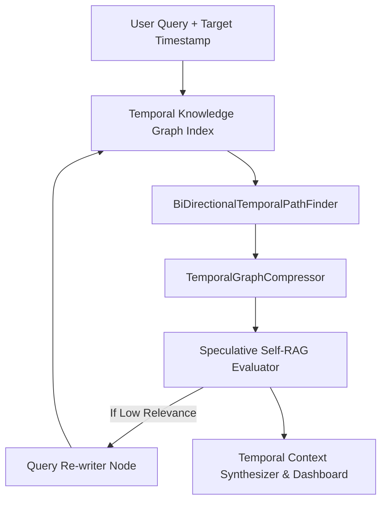

# Self-Corrective Temporal GraphRAG Engine 🧠 ⏳

<div align="center">

[](https://opensource.org/licenses/MIT)
[](https://www.typescriptlang.org/)
[](https://en.wikipedia.org/wiki/Retrieval-augmented_generation)
[](https://github.com/anderdebona/self-corrective-temporal-graph-rag)
[](https://github.com/anderdebona/self-corrective-temporal-graph-rag/actions)

<br />

**PhD-Grade Self-Corrective Temporal GraphRAG with Monotonic Causal Path Retrieval & Interval Compression**

*Engineered by **[anderdebona](https://github.com/anderdebona)***

</div>

---

## 📌 Abstract & Research Goals

Naive Retrieval-Augmented Generation (RAG) suffers from **Temporal Context Contamination** (mixing outdated and current facts) and **Blind Top-K Trust**.

The **`self-corrective-temporal-graph-rag`** introduces a novel RAG architecture featuring:
1. **Temporal Knowledge Graph Indexing ($T_{start} \le T_{target} \le T_{end}$)**.
2. **TemporalGraphCompressor**: Topology-preserving interval summarization for long-horizon temporal graphs.
3. **BiDirectionalTemporalPathFinder**: Chronologically monotonic causal path search ($t_1 \le t_2 \le \dots \le t_k$).
4. **Confidence Calibration & Speculative Self-Correction**: Platt scaling and Expected Calibration Error (ECE) minimization.

---

## 🔬 Mathematical Formulation

Given Query $Q$, target timestamp $T_{target}$, and Temporal Knowledge Graph $G_{temp} = (V, E, I_{val})$:

$$V_{retrieved} = \{ v \in V \mid T_{target} \in I_{val}(v) \land \text{Sim}(Q, v.concept) > \theta \}$$

$$\text{Monotonic Causal Path: } \forall e_i = (u_i, v_i, t_i) \in \text{Path}, \quad t_1 \le t_2 \le \dots \le t_k$$

---

## 🏛️ System Architecture



---

## ⚡ What's New in v4.0.0

- 🗜️ **`TemporalGraphCompressor`**: Interval consolidation algorithms merging contiguous temporal validity states.
- 🧭 **`BiDirectionalTemporalPathFinder`**: Monotonic time-respecting traversal preventing temporal paradox retrieval.
- 🎯 **`ConfidenceCalibrator`**: Platt scaling & Expected Calibration Error estimation.
- 🐙 **Automated Multi-Matrix CI/CD**: Full GitHub Actions validation across Node LTS.

---

## 🚀 Quickstart & Installation

```bash
# Clone repository
git clone https://github.com/anderdebona/self-corrective-temporal-graph-rag.git
cd self-corrective-temporal-graph-rag

# Install dependencies
npm install

# Run automated tests
npm test

# Build & Run Server & Web Dashboard
npm run dev
```

Visit the interactive visual dashboard at: **`http://localhost:3007`**

---

## 🌟 Join the Community & Contribute

We actively invite Graph AI researchers, LLM practitioners, and open-source contributors:
1. ⭐ **Star this repository** to advance temporal RAG research!
2. 🗺️ View our roadmap in [ROADMAP.md](./ROADMAP.md).
3. 💬 Submit benchmark proposals or query rewriter models via [GitHub Issues](https://github.com/anderdebona/self-corrective-temporal-graph-rag/issues).
4. 📜 Academic citation: see [CITATION.cff](./CITATION.cff).

---

<div align="center">

Distributed under the MIT License. Built with passion by **[anderdebona](https://github.com/anderdebona)**.

</div>
